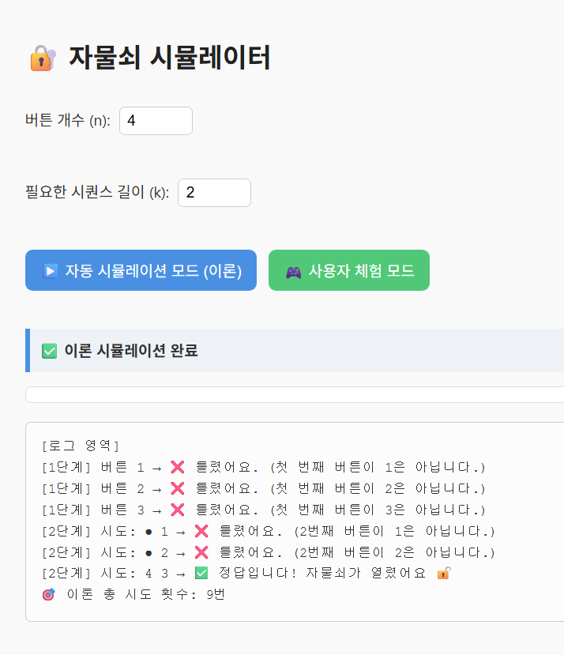

# 🔐 자물쇠 시뮬레이터 (Lock Simulation)

직관적으로 **이론적인 알고리즘**과 **실제 체험 모드**를 비교할 수 있는 자바스크립트 기반 웹 시뮬레이터입니다.

---

## 🧩 문제 설명

n개의 버튼이 있는 자물쇠는 연속된 k개의 버튼을 정확한 순서로 눌러야만 열립니다.

- 버튼을 누르는 도중 틀리면 다시 처음부터 시작합니다.
- 이미 맞춘 버튼은 상태를 유지하며, 같은 버튼을 다시 누르지는 않습니다.
- 최악의 경우를 기준으로 자물쇠를 여는 데 필요한 **최소한의 시도 횟수**를 계산합니다.

---

## 🎮 기능

| 기능 구분                      | 설명                                                                     |
| ------------------------------ | ------------------------------------------------------------------------ |
| ▶️ 자동 시뮬레이션 모드 (이론) | 최악의 경우에 자물쇠를 여는 데 필요한 시도 횟수와 과정을 단계별로 시각화 |
| 🎮 사용자 체험 모드            | 실제로 버튼을 눌러 자물쇠를 푸는 체험. 정답은 랜덤하게 생성됨            |

---

## 📷 시뮬레이션 화면



---

## 🛠 사용 방법

1. 프로젝트 클론

```bash
git clone https://github.com/your-username/lock-simulator.git
cd lock-simulator
```

2. 브라우저에서 실행
   `Q3.html` 파일을 브라우저에서 열면 바로 실행됩니다.

## 📁 파일 구성

```
lock-simulator/
├── Q3.html       # 메인 HTML 파일
├── screenshot.png   # 시뮬레이션 이미지
└── README.md        # 설명 문서
```

---

## 📚 관련 개념

- 완전탐색 (Brute-force)
- 조합과 순열
- 최악의 경우 분석
- 사용자 인터랙션을 통한 알고리즘 체험

---

## 📝 라이선스

MIT License
